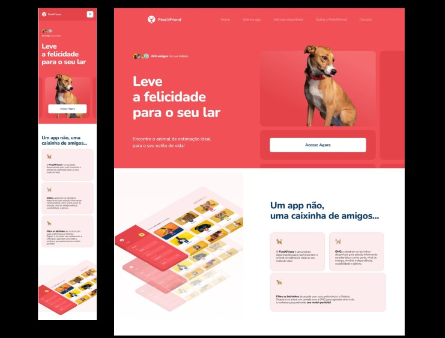

<h1 align="center">Find A Friend</h1>

  &nbsp;&nbsp;O Green Chain Challenge é um projeto desenvolvido pela Rockeseat especialmente para a os alunos do programa EXPLORER com desafios que simulam situações reais que, você dev, vai encontrar no mercado de trabalho!
   

  &nbsp;&nbsp;&nbsp;O projeto será baseado em empresas fictícias com diversos perfis, entregas por sprints e muitos desafios. De tempos em tempos teremos um projeto novo por aqui com data para iniciar e terminar!

  <a href="#-tecnologias">Tecnologias</a>&nbsp;&nbsp;&nbsp;|&nbsp;&nbsp;&nbsp;
  <a href="#-projeto">Projeto</a>&nbsp;&nbsp;&nbsp;|&nbsp;&nbsp;&nbsp;
  <a href="#-layout">Layout</a>&nbsp;&nbsp;&nbsp;|&nbsp;&nbsp;&nbsp;
  <a href="#memo-licença">Licença</a>

  

 

  

 

## 🚀 Tecnologias

Esse projeto foi desenvolvido com as seguintes tecnologias:

- HTML e CSS
- Javascript
- Figma

 
## 💻 Projeto
 
 
&nbsp;&nbsp;&nbsp;O FindAFriend é um produto desenvolvido para a Startup onde você pode encontrar o animal de estimação ideal para seu estilo de vida! No FindAFriend, as ONGs cadastram os bichinhos disponíveis para adoção informando características como: porte, nível de energia, nível de independência, sociabilidade e gênero.
 
 
O projeto será responsivo, para que possa ser acessado por diversos dispositivos. Agora o projeto está tomando forma, pois já temos um corpo para nossa aplicação onde é apresentado mais informações sobre nossos aumigos.
 
 
Foi adicionada mais um sessão no nosso projeto, onde foi inserido um carrosel de imagens com alguns de nossos aumigos.
 
 
E por fim foram adicionados o uma nova Sessão ao projeto que aborda o conteúdo sobre a empresa e entre em contato. Também adicionamos o footer do projeto. Essa parte final do projeto foi muito desafiador, pois trabalhei com vários eventos no javascript que não tinha familiaridade.
 
 
Estou muito satisfeita com minha evolução neste projeto, onde consegui colocar em prática vários conceitos aprendidos e pudi aprender várias outras técnicas.
 
 
- [Visite o projeto]( https://wilkasantos.github.io/GCCExplorer-FindAFriend/ )
 
 
## 🔖 Layout

O layout do projeto encontra-se no Figma e você pode ter acesso através [DESSE LINK](https://www.figma.com/file/XlX73ewpCuNXgWtuSxvQfL/Find-A-Friend-(LP)?t=BhgHgz4l0MhWr5tV-0).

 
## 🔒 Layout

Esse projeto está sob a licença MIT.
